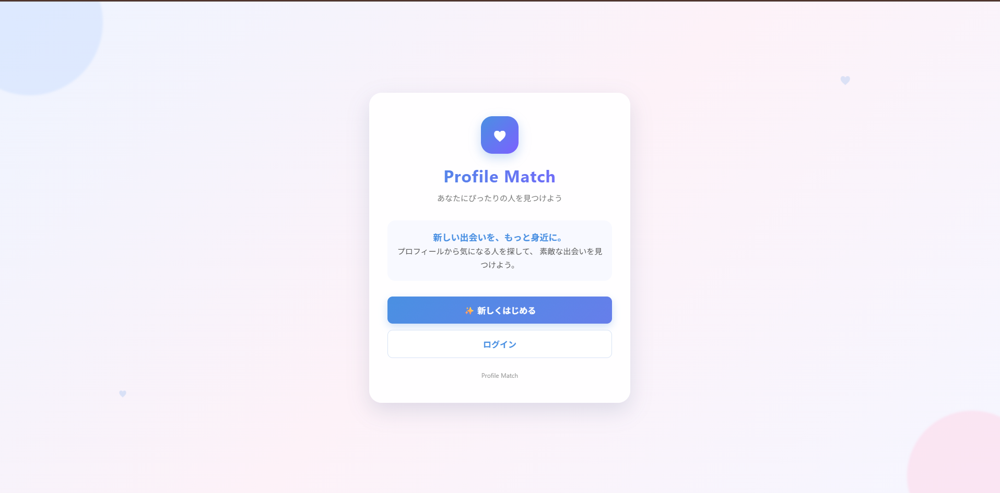

# Profile Match



## 概要

**Profile Match** は、ユーザー同士のプロフィールを条件検索し、気になるユーザーをブックマークすることでマッチングを行うWebアプリケーションである。

ユーザーは、自身のプロフィール情報を登録・編集し、年齢・身長・年収・地域などの条件から他のユーザーを検索できる。

気になるユーザーをブックマークし、**お互いにブックマークするとマッチングが成立する**。
マッチング成立後は、1対1のチャット機能を利用してメッセージを送受信できる。

また、プロフィール画像のアップロードにはAmazon S3を利用し、AWS Lambdaによって画像のサムネイルを自動生成する構成としている。

本アプリケーションの開発を通して、**FastAPIによるWeb API開発、JavaScriptによるフロントエンド開発、AWSを利用したWebアプリケーション構築、DynamoDBによるデータ管理、S3による画像管理、Lambdaによる画像処理、JWTによる認証**などを実践した。

---

# 目次

* [概要](#概要)
* [開発目的](#開発目的)
* [主な機能](#主な機能)
* [画面構成](#画面構成)
* [画面遷移](#画面遷移)
* [各画面の役割](#各画面の役割)

  * [ホーム画面](#1-ホーム画面)
  * [新規登録画面](#2-新規登録画面)
  * [ログイン画面](#3-ログイン画面)
  * [マイページ](#4-マイページ)
  * [プロフィール編集画面](#5-プロフィール編集画面)
  * [検索画面](#6-検索画面)
  * [プロフィール画面](#7-プロフィール画面)
  * [ブックマーク画面](#8-ブックマーク画面)
  * [マッチ一覧画面](#9-マッチ一覧画面)
  * [チャット画面](#10-チャット画面)
* [AWS構成](#AWS構成)
* [AWSサービスの役割](#AWSサービスの役割)
* [システム構成](#システム構成)
* [データ構成](#データ構成)
* [API構成](#API構成)
* [認証](#認証)
* [プロフィール画像処理](#プロフィール画像処理)
* [使用技術](#使用技術)
* [ディレクトリ構成](#ディレクトリ構成)
* [開発を通して学んだこと](#開発を通して学んだこと)
* [今後の改善案](#今後の改善案)

---

# 開発目的

本アプリケーションは、AWSを利用したWebアプリケーション開発を実践的に学習することを目的として開発した。

特に以下の技術について、実際にアプリケーションを構築しながら理解することを目指した。

* FastAPIによるREST API開発
* HTML / CSS / JavaScriptによるフロントエンド開発
* AWS EC2を利用したバックエンドサーバー構築
* Amazon DynamoDBを利用したデータ管理
* Amazon S3を利用した画像ファイル管理
* AWS Lambdaを利用した画像処理
* Application Load Balancer（ALB）を利用したアクセス制御
* JWTを利用したユーザー認証
* CORSを考慮したフロントエンド・バックエンド間通信
* AWS上でのWebアプリケーション構築

---

# 主な機能

## 1. ユーザー登録

以下のプロフィール情報を登録できる。

* 名前
* メールアドレス
* パスワード
* 年齢
* 身長
* 性別
* 職種
* 年収
* 地域
* 趣味

---

## 2. ログイン

メールアドレスとパスワードを利用してログインする。

ログインに成功するとJWTを取得し、ブラウザの`localStorage`にアクセストークンを保存する。

---

## 3. プロフィール表示

登録されているプロフィール情報を確認できる。

表示項目：

* プロフィール画像
* 名前
* 年齢
* 身長
* 性別
* 職種
* 年収
* 地域
* 趣味

---

## 4. プロフィール編集

登録済みのプロフィール情報を確認し、各項目を個別に変更できる。

例：

```text
名前        吉岡諒太              [変更]
年齢        23歳                  [変更]
身長        172cm                 [変更]
性別        男性                  [変更]
職種        学生                  [変更]
年収        500万円               [変更]
地域        埼玉県                [変更]
趣味        映画、旅行、ゲーム     [変更]
```

---

## 5. プロフィール画像アップロード

プロフィール編集画面からプロフィール画像をアップロードできる。

対応形式：

* JPEG
* PNG
* WebP

アップロードされた画像はAmazon S3に保存される。

さらに、AWS Lambdaを利用して画像のサムネイルを生成する。

---

## 6. ユーザー検索

以下の条件を指定してユーザーを検索できる。

* 最小年齢
* 最大年齢
* 最小身長
* 最大身長
* 最小年収
* 最大年収
* 地域

検索結果には、自分自身のプロフィールは表示されない。

---

## 7. プロフィール詳細

検索結果からユーザーを選択すると、そのユーザーのプロフィール詳細を確認できる。

プロフィール画像が登録されている場合は、S3に保存された画像のサムネイルを表示する。

---

## 8. ブックマーク

気になるユーザーをブックマークできる。

ブックマークしたユーザーはブックマーク一覧から確認できる。

---

## 9. マッチング

ユーザーAがユーザーBをブックマークし、ユーザーBもユーザーAをブックマークするとマッチングが成立する。

```text
ユーザーA
   │
   │ ブックマーク
   ▼
ユーザーB
   │
   │ 相互ブックマーク
   ▼
マッチング成立
```

---

## 10. メッセージ

マッチングが成立したユーザー同士でメッセージを送受信できる。

チャット画面では、定期的にAPIへアクセスしてメッセージを取得することで、新しいメッセージを表示する。

現在は約3秒間隔でメッセージを取得する方式としている。

---

# 画面構成

本アプリケーションでは、以下の画面を実装している。

| 画面       | ファイル                | 役割             |
| -------- | ------------------- | -------------- |
| ホーム      | `index.html`        | サービスの入口        |
| 新規登録     | `register.html`     | ユーザー登録         |
| ログイン     | `login.html`        | ユーザー認証         |
| マイページ    | `mypage.html`       | 自分のプロフィール確認    |
| プロフィール編集 | `profile_edit.html` | プロフィール情報・画像の変更 |
| 検索       | `search.html`       | 条件によるユーザー検索    |
| プロフィール   | `profile.html`      | 他ユーザーの詳細確認     |
| ブックマーク   | `bookmarks.html`    | ブックマーク一覧       |
| マッチ一覧    | `messages.html`     | マッチしたユーザー一覧    |
| チャット     | `chat.html`         | メッセージ送受信       |

---

# 画面遷移

```text
                    ┌───────────────┐
                    │  ホーム画面   │
                    │ index.html    │
                    └───────┬───────┘
                            │
              ┌─────────────┴─────────────┐
              │                           │
              ▼                           ▼
      ┌───────────────┐          ┌───────────────┐
      │ 新規登録画面  │          │ ログイン画面  │
      │ register.html │          │ login.html    │
      └───────┬───────┘          └───────┬───────┘
              │                           │
              └─────────────┬─────────────┘
                            ▼
                    ┌───────────────┐
                    │  マイページ   │
                    │ mypage.html   │
                    └───────┬───────┘
                            │
            ┌───────────────┼────────────────┐
            │               │                │
            ▼               ▼                ▼
    ┌──────────────┐ ┌──────────────┐ ┌──────────────┐
    │ プロフィール │ │   検索画面   │ │ ブックマーク │
    │    編集      │ │ search.html  │ │   bookmarks  │
    │profile_edit  │ └──────┬───────┘ │    .html     │
    └──────────────┘        │         └──────────────┘
                            ▼
                    ┌───────────────┐
                    │プロフィール   │
                    │ profile.html  │
                    └───────┬───────┘
                            │
                       ブックマーク
                            │
                            ▼
                    ┌───────────────┐
                    │ マッチング成立│
                    └───────┬───────┘
                            │
                            ▼
                    ┌───────────────┐
                    │ マッチ一覧    │
                    │ messages.html │
                    └───────┬───────┘
                            │
                            ▼
                    ┌───────────────┐
                    │ チャット画面  │
                    │ chat.html     │
                    └───────────────┘
```

---

# 各画面の役割

## 1. ホーム画面

ファイル：

```text
index.html
```

Profile Matchの入口となる画面。

新規登録またはログイン画面へ移動できる。

### スクリーンショット

<!-- ここにホーム画面のスクリーンショットを追加 -->

```text
[ホーム画面スクリーンショット]
```

---

## 2. 新規登録画面

ファイル：

```text
register.html
```

新しいユーザーを登録する画面。

ユーザーが入力した情報をバックエンドAPIへ送信し、DynamoDBのUsersテーブルへ保存する。

### スクリーンショット

<!-- ここに新規登録画面のスクリーンショットを追加 -->

```text
[新規登録画面スクリーンショット]
```

---

## 3. ログイン画面

ファイル：

```text
login.html
```

登録済みユーザーがログインする画面。

ログイン成功時にJWTアクセストークンを取得し、ブラウザの`localStorage`に保存する。

### スクリーンショット

<!-- ここにログイン画面のスクリーンショットを追加 -->

```text
[ログイン画面スクリーンショット]
```

---

## 4. マイページ

ファイル：

```text
mypage.html
```

ログイン中のユーザー自身のプロフィールを確認する画面。

プロフィール情報の確認に加えて、プロフィール編集画面や検索画面などへ移動できる。

### スクリーンショット

<!-- ここにマイページのスクリーンショットを追加 -->

```text
[マイページスクリーンショット]
```

---

## 5. プロフィール編集画面

ファイル：

```text
profile_edit.html
```

自身のプロフィール情報を編集する画面。

各項目について、現在登録されている値を表示し、「変更」ボタンから個別に編集できる。

また、プロフィール画像のアップロードもこの画面から行う。

### 編集項目

* 名前
* 年齢
* 身長
* 性別
* 職種
* 年収
* 地域
* 趣味
* プロフィール画像

### スクリーンショット

<!-- ここにプロフィール編集画面のスクリーンショットを追加 -->

```text
[プロフィール編集画面スクリーンショット]
```

---

## 6. 検索画面

ファイル：

```text
search.html
```

条件を指定して他のユーザーを検索する画面。

検索条件：

* 年齢
* 身長
* 年収
* 地域

検索結果には自分自身のユーザー情報を除外して表示する。

検索結果からプロフィール詳細を確認したり、ユーザーをブックマークしたりできる。

### スクリーンショット

<!-- ここに検索画面のスクリーンショットを追加 -->

```text
[検索画面スクリーンショット]
```

---

## 7. プロフィール画面

ファイル：

```text
profile.html
```

検索結果などから選択したユーザーのプロフィール詳細を表示する。

プロフィール画像、年齢、身長、性別、職種、年収、地域、趣味などを確認できる。

また、この画面からユーザーをブックマークできる。

### スクリーンショット

<!-- ここにプロフィール画面のスクリーンショットを追加 -->

```text
[プロフィール画面スクリーンショット]
```

---

## 8. ブックマーク画面

ファイル：

```text
bookmarks.html
```

自分がブックマークしたユーザーを一覧表示する。

ブックマークの解除もこの画面から行える。

### スクリーンショット

<!-- ここにブックマーク画面のスクリーンショットを追加 -->

```text
[ブックマーク画面スクリーンショット]
```

---

## 9. マッチ一覧画面

ファイル：

```text
messages.html
```

マッチングが成立したユーザーを一覧表示する。

ユーザーを選択すると、そのユーザーとのチャット画面へ移動する。

### スクリーンショット

<!-- ここにマッチ一覧画面のスクリーンショットを追加 -->

```text
[マッチ一覧画面スクリーンショット]
```

---

## 10. チャット画面

ファイル：

```text
chat.html
```

マッチングしたユーザー同士でメッセージを送受信する画面。

メッセージはDynamoDBのMessagesテーブルに保存される。

新しいメッセージを取得するため、一定間隔でAPIを呼び出している。

### スクリーンショット

<!-- ここにチャット画面のスクリーンショットを追加 -->

```text
[チャット画面スクリーンショット]
```

---

# AWS構成

本アプリケーションでは、複数のAWSサービスを組み合わせてシステムを構築している。

```text
                           Internet
                              │
                              ▼
                    ┌──────────────────┐
                    │   S3 Static Web   │
                    │  HTML / CSS / JS  │
                    └────────┬─────────┘
                             │
                             │ HTTP API
                             ▼
                    ┌──────────────────┐
                    │       ALB        │
                    │ Application Load │
                    │     Balancer     │
                    └────────┬─────────┘
                             │
                             ▼
                    ┌──────────────────┐
                    │       EC2        │
                    │     FastAPI      │
                    │     Uvicorn      │
                    └──────┬─────┬─────┘
                           │     │
                 ┌─────────┘     └─────────┐
                 ▼                         ▼
        ┌─────────────────┐       ┌─────────────────┐
        │   DynamoDB      │       │       S3        │
        │                 │       │ Profile Images  │
        │ Users           │       │                 │
        │ Matches         │       └────────┬────────┘
        │ Messages        │                │
        └─────────────────┘                │
                                           ▼
                                  ┌─────────────────┐
                                  │      Lambda     │
                                  │ Image Resize /  │
                                  │   Thumbnail     │
                                  └─────────────────┘
```

---

# AWSサービスの役割

## Amazon EC2

バックエンドAPIサーバーとして使用している。

EC2上でFastAPIアプリケーションを実行し、Uvicornを利用してAPIサーバーを起動している。

主な役割：

* FastAPIの実行
* REST APIの提供
* JWT認証処理
* DynamoDBとの通信
* S3との通信
* プロフィール画像API
* 検索API
* ブックマークAPI
* マッチングAPI
* メッセージAPI

---

## Application Load Balancer

EC2上で動作するFastAPIへのアクセスを受け付ける。

```text
ユーザー
   │
   ▼
ALB
   │
   ▼
EC2
   │
   ▼
FastAPI
```

外部からバックエンドAPIへアクセスするための入口として利用している。

---

## Amazon S3

主に以下の用途で使用している。

### 静的Webページ

HTML、CSS、JavaScriptなどのフロントエンドファイルを配置する。

```text
index.html
login.html
register.html
search.html
...
```

### プロフィール画像

ユーザーがアップロードしたプロフィール画像を保存する。

保存例：

```text
profile-images/
└── user001/
    ├── original.jpg
    └── thumbnail.jpg
```

---

## Amazon DynamoDB

ユーザー情報やマッチング情報、メッセージなどのデータを保存する。

使用している主なテーブル：

```text
Users
Matches
Messages
```

### Users

ユーザーのプロフィール情報を保存する。

主な項目：

```text
user_id
name
email
password
gender
age
height
job
income
region
hobbies
profile_image
```

---

### Matches

ユーザー同士のマッチング情報を保存する。

```text
match_id
user1
user2
```

---

### Messages

マッチングしたユーザー同士のメッセージを保存する。

```text
message_id
match_id
sender_id
content
created_at
```

---

## AWS Lambda

プロフィール画像の加工処理に使用している。

ユーザーがS3へプロフィール画像をアップロードすると、Lambdaによって画像を処理し、サムネイル画像を生成する。

```text
ユーザー
   │
   │ 画像アップロード
   ▼
S3
   │
   │ イベント
   ▼
Lambda
   │
   │ リサイズ
   ▼
thumbnail.jpg
```

これにより、元画像をそのままWeb画面へ表示するのではなく、表示用のサイズに調整されたサムネイル画像を利用できる。

---

# システム構成

全体として、以下のような構成になっている。

```text
┌──────────────────────────────┐
│          Browser             │
│                              │
│ HTML / CSS / JavaScript      │
└──────────────┬───────────────┘
               │
               │ API Request
               ▼
┌──────────────────────────────┐
│             ALB              │
└──────────────┬───────────────┘
               │
               ▼
┌──────────────────────────────┐
│             EC2              │
│                              │
│ FastAPI + Uvicorn            │
│                              │
│ ├── Authentication           │
│ ├── User Search              │
│ ├── Bookmark                 │
│ ├── Matching                 │
│ ├── Messaging                │
│ └── Profile Image            │
└───────┬──────────────┬───────┘
        │              │
        ▼              ▼
┌───────────────┐  ┌───────────────┐
│   DynamoDB    │  │      S3       │
│               │  │               │
│ Users         │  │ Images        │
│ Matches       │  │               │
│ Messages      │  │               │
└───────────────┘  └───────┬───────┘
                           │
                           ▼
                    ┌──────────────┐
                    │    Lambda    │
                    │              │
                    │ Thumbnail    │
                    └──────────────┘
```

---

# データ構成

## Users

ユーザーのプロフィール情報を管理する。

```text
Users
├── user_id
├── name
├── email
├── password
├── gender
├── age
├── height
├── job
├── income
├── region
├── hobbies
└── profile_image
```

---

## Matches

マッチング情報を管理する。

```text
Matches
├── match_id
├── user1
└── user2
```

相互ブックマークが成立した際にマッチング情報が作成される。

---

## Messages

チャットメッセージを管理する。

```text
Messages
├── message_id
├── match_id
├── sender_id
├── content
└── created_at
```

`match_id`によって、どのユーザー同士のチャットであるかを識別する。

---

# API構成

FastAPIを利用してREST APIを構築している。

主なAPI：

| Method | Endpoint                           | 内容             |
| ------ | ---------------------------------- | -------------- |
| POST   | `/api/register`                    | ユーザー登録         |
| POST   | `/api/login`                       | ログイン           |
| GET    | `/api/me`                          | 自分の情報取得        |
| GET    | `/api/users`                       | ユーザー検索         |
| GET    | `/api/users/{user_id}`             | ユーザー情報取得       |
| POST   | `/api/bookmarks`                   | ブックマーク登録       |
| GET    | `/api/bookmarks`                   | ブックマーク一覧       |
| DELETE | `/api/bookmarks/{user_id}`         | ブックマーク解除       |
| GET    | `/api/matches`                     | マッチ一覧          |
| GET    | `/api/messages/{match_id}`         | メッセージ取得        |
| POST   | `/api/messages`                    | メッセージ送信        |
| POST   | `/api/profile/image`               | プロフィール画像アップロード |
| GET    | `/api/profile/image-url/{user_id}` | プロフィール画像URL取得  |

---

# 認証

ユーザー認証にはJWTを利用している。

ログイン時にバックエンドでJWTを発行し、フロントエンド側でアクセストークンを保存する。

```text
ログイン
   │
   ▼
FastAPI
   │
   │ JWT発行
   ▼
Browser
   │
   │ localStorage
   ▼
access_token
```

認証が必要なAPIへアクセスする際には、HTTP AuthorizationヘッダーにJWTを付与する。

```text
Authorization: Bearer <JWT>
```

例えばメッセージAPIでは、JWTを利用して現在のユーザーを確認し、マッチングしていないユーザーが他人のチャットへアクセスすることを防止している。

---

# プロフィール画像処理

プロフィール画像はAmazon S3を利用して管理している。

処理の流れ：

```text
① ユーザーが画像を選択
        │
        ▼
② FastAPIへアップロード
        │
        ▼
③ ファイル形式・サイズを検証
        │
        ▼
④ S3へoriginal.jpgを保存
        │
        ▼
⑤ DynamoDBへS3キーを保存
        │
        ▼
⑥ S3イベントをLambdaが検知
        │
        ▼
⑦ Lambdaが画像をリサイズ
        │
        ▼
⑧ thumbnail.jpgを生成
        │
        ▼
⑨ プロフィール画面からサムネイルを取得
```

FastAPIではアップロードされた画像について、

* JPEG
* PNG
* WebP

のみを許可し、10MB以下であることを確認している。

また、Pillowを利用して画像ファイルとして正常に読み込めるかを検証している。

---

# 使用技術

## Frontend

* HTML
* CSS
* JavaScript
* Fetch API
* LocalStorage

## Backend

* Python
* FastAPI
* Uvicorn
* boto3
* Pillow
* JWT

## AWS

* Amazon EC2
* Amazon S3
* Amazon DynamoDB
* AWS Lambda
* Application Load Balancer

---

# ディレクトリ構成

```text
profile-match/
│
├── app/
│   ├── main.py
│   │
│   ├── models/
│   │   ├── message.py
│   │   └── user.py
│   │
│   ├── routers/
│   │   ├── auth.py
│   │   ├── bookmarks.py
│   │   ├── matches.py
│   │   ├── messages.py
│   │   ├── profile.py
│   │   └── users.py
│   │
│   ├── services/
│   │   ├── auth.py
│   │   ├── messages.py
│   │   └── suth.py
│   │
│   ├── config.py
│   └── database.py
│
├── frontend/
│   ├── index.html
│   ├── login.html
│   ├── register.html
│   ├── mypage.html
│   ├── profile_edit.html
│   ├── profile.html
│   ├── search.html
│   ├── bookmarks.html
│   ├── messages.html
│   ├── chat.html
│   │
│   └── js/
│       ├── common.js
│       ├── search.js
│       ├── bookmarks.js
│       ├── messages.js
│       └── chat.js
│
├── lambda/
│   └── image.py
│
├── requirements.txt
└── README.md
```

---

# 開発を通して学んだこと

本開発では、単純なWebページの作成だけではなく、フロントエンド、バックエンド、データベース、クラウドサービスを組み合わせたWebアプリケーションを一通り構築した。

特に以下について実践的に学ぶことができた。

### 1. API設計

FastAPIを利用して、ユーザー登録、ログイン、検索、ブックマーク、マッチング、メッセージなどのAPIを実装した。

---

### 2. DynamoDBによるデータ管理

ユーザー情報、マッチング情報、メッセージをDynamoDBで管理し、APIからデータを取得・更新する処理を実装した。

---

### 3. AWSサービスの連携

EC2、S3、DynamoDB、Lambda、ALBをそれぞれ単独で利用するだけではなく、複数のAWSサービスを連携させて1つのWebアプリケーションを構築した。

---

### 4. 認証・認可

JWTを利用したログイン認証を実装した。

また、単にログイン状態を確認するだけではなく、マッチングしたユーザーだけがチャットへアクセスできるようにするなど、API側で権限を確認する処理も実装した。

---

### 5. クラウド環境でのトラブルシューティング

開発中には、

* CORS
* Mixed Content
* HTTP / HTTPS
* EC2のポート
* S3アクセス
* IAM権限
* DynamoDB
* APIエンドポイント
* JWT認証

など、ローカル環境だけでは発生しにくい問題にも対応した。

実際にAWS上へアプリケーションを構築することで、Webアプリケーションがどのように複数のコンポーネントから構成されているのかを理解できた。

---

# 今後の改善案

現在のアプリケーションをさらに発展させる場合、以下の機能を追加することが考えられる。

## HTTPS化

現在は学習目的でHTTPを利用しているが、本番環境で利用する場合はHTTPS化する。

---

## WebSocketによるリアルタイムチャット

現在のチャット機能では一定間隔でAPIへアクセスして新しいメッセージを取得している。

今後はWebSocketを利用することで、リアルタイムにメッセージを送受信できるようにする。

---

## パスワードのセキュリティ強化

本番環境ではパスワードを安全なハッシュ方式で保存し、認証周りのセキュリティをさらに強化する。

---

## より高度な検索

以下のような条件を追加する。

* 複数の趣味
* 職種
* 性別
* キーワード
* 複数条件の組み合わせ

---

## 通知機能

マッチング成立時や新しいメッセージ受信時に通知を行う。

---

## AWS構成のさらなる改善

将来的には以下のような構成も検討できる。

```text
CloudFront
     │
     ▼
    S3
     │
     │
     ▼
    ALB
     │
     ▼
   EC2 / ECS
     │
 ┌───┴────┐
 ▼        ▼
DynamoDB  S3
           │
           ▼
        Lambda
```

CloudFrontやECSなどを導入することで、より本番環境を意識した構成へ発展させることができる。

---

# まとめ

Profile Matchは、ユーザー登録・ログイン・プロフィール管理・ユーザー検索・ブックマーク・マッチング・メッセージ機能を備えたWebマッチングアプリケーションである。

バックエンドにはFastAPI、データベースにはDynamoDB、画像保存にはS3、画像処理にはLambda、APIサーバーにはEC2、アクセス制御にはApplication Load Balancerを利用している。

```text
Frontend
HTML / CSS / JavaScript
        │
        ▼
Application Load Balancer
        │
        ▼
EC2
FastAPI
        │
 ┌──────┼──────────┐
 ▼      ▼          ▼
DynamoDB S3       Lambda
```

AWSの複数サービスを組み合わせることで、Webアプリケーションの基本的な機能から、認証、画像管理、データベース、マッチング、メッセージングまでを一通り実装した。

今後はHTTPS化、WebSocketによるリアルタイム通信、セキュリティ強化などを行うことで、より実用的なWebサービスへ発展させることができる。

---

# スクリーンショット一覧

READMEの上部などでアプリケーションの完成イメージを紹介する場合は、以下のようにスクリーンショットを追加できる。

## ホーム

<!-- 画像をここに追加 -->

## 新規登録

<!-- 画像をここに追加 -->

## ログイン

<!-- 画像をここに追加 -->

## マイページ

<!-- 画像をここに追加 -->

## プロフィール編集

<!-- 画像をここに追加 -->

## ユーザー検索

<!-- 画像をここに追加 -->

## プロフィール

<!-- 画像をここに追加 -->

## ブックマーク

<!-- 画像をここに追加 -->

## マッチ一覧

<!-- 画像をここに追加 -->

## チャット

<!-- 画像をここに追加 -->

